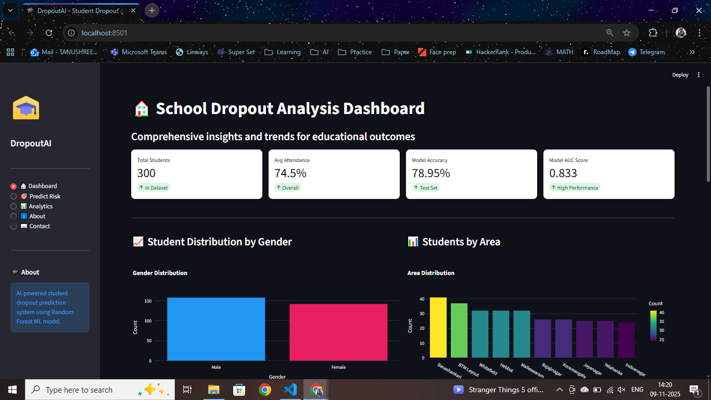

# 🎓 DropoutAI - Student Dropout Prediction System

A data-driven software solution developed to analyse student dropout patterns across government schools in Karnataka. This project supports the Right to Education initiative by enabling focused policy interventions based on insights from dropout data. *Dropout AI* AI-powered student dropout prediction system using Random Forest machine learning to help educational institutions identify at-risk students and take proactive measures.

## 🌟 Features

- **Real-time Predictions**: Instant dropout risk assessment for individual students
- **Interactive Dashboard**: Comprehensive data visualizations and insights
- **Analytics**: Explore patterns and correlations in student data
- **Risk Categorization**: High, Medium, Low risk levels with actionable recommendations
- **Model Performance**: Random Forest classifier with high accuracy

## 🚀 Demo



## 📊 Tech Stack

- **Frontend**: Streamlit
- **ML Framework**: Scikit-learn
- **Data Processing**: Pandas, NumPy
- **Visualization**: Plotly
- **Model**: Random Forest Classifier

## 🛠️ Installation

### Prerequisites

- Python 3.8 or higher
- pip

## 🎯 Usage

### 1. Dashboard
View comprehensive insights about student data including:
- Student demographics
- Attendance and performance distributions
- Model performance metrics

### 2. Predict Risk
Enter student information to get:
- Dropout probability
- Risk level (High/Medium/Low)
- Top risk factors
- Personalized recommendations

### 3. Analytics
Explore patterns and correlations:
- Attendance vs Performance
- Distance vs Attendance
- Family income distribution
- Parental education levels

## 📈 Model Performance

- **Accuracy**: 78.95% 
- **AUC Score**: 0.833 
- **Algorithm**: Random Forest Classifier

## 🤝 Contributing

Contributions are welcome! Please feel free to submit a Pull Request.

1. Fork the project
2. Create your feature branch (`git checkout -b feature/AmazingFeature`)
3. Commit your changes (`git commit -m 'Add some AmazingFeature'`)
4. Push to the branch (`git push origin feature/AmazingFeature`)
5. Open a Pull Request

Project Link: [https://github.com/kav-star/student_dropout](https://github.com/kav-star/student_dropout)

## 🙏 Acknowledgments

- CBD_7 - Capstone Project Team
- Presidency University

Guide:
- Dr. Abdul Majid

Team Members:
- Tanushree R
- Kavya J
- Kavya S

## Step 4: Setup Instructions

1. **Clone the repository**
```bash
   git clone https://github.com/kav-star/student_dropout.git
   cd student_dropout
```

2. **Create virtual environment**
```bash
   # Windows
   python -m venv venv
   venv\Scripts\activate

   # macOS/Linux
   python3 -m venv venv
   source venv/bin/activate
```

3. **Install dependencies**
```bash
   pip install -r requirements.txt
```

4. **Run the application**
```bash
   streamlit run app.py
```

5. **Open in browser**
   - The app will automatically open at `http://localhost:8501`